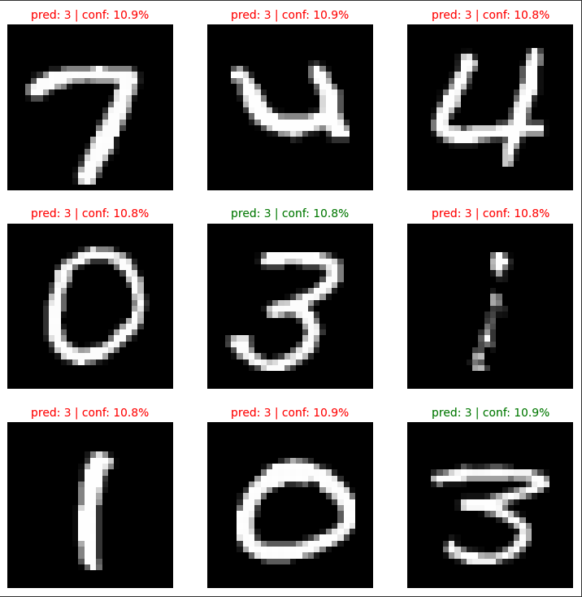
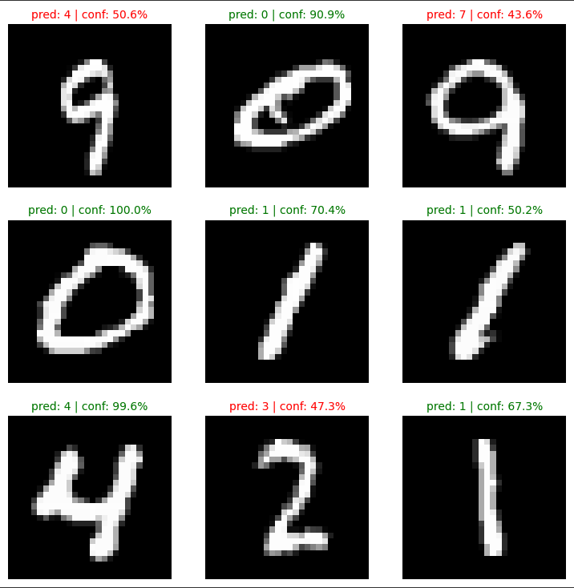
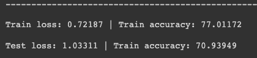
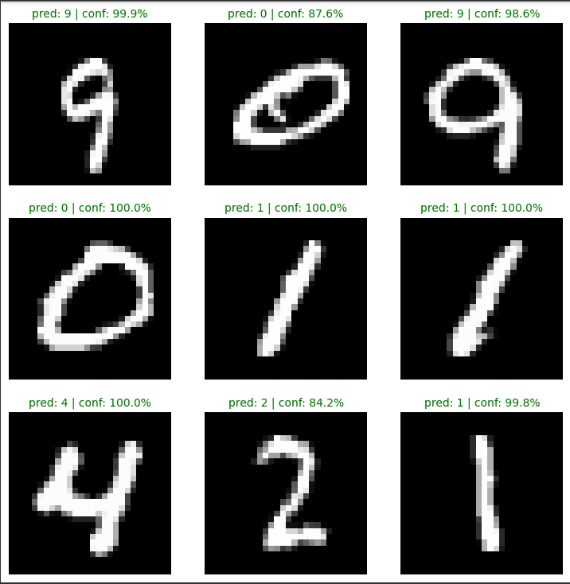
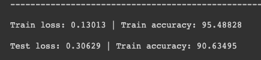

# Convolutional Neural Network (CNN) for Number Classification

This repository contains a PyTorch implementation of a Convolutional Neural Network (CNN) for classifying the MNIST Number dataset. 
The code provides a complete pipeline for training the model, evaluating its performance, and making predictions on test samples.

# Running the model
# Training with 1000 samples and 20 epochs

##### 0 epoch

This is how the model performs before undergoing any training, where you can see it's basically just doing random guessing.

##### 10 epoch

After 10 epochs of training, the model starts to correctly make prediction with medium confidence.

##### 20 epoch

After 20 epochs of training, the model is finally able to confidently make prediction with high degree of accuracy.

# Code Overview
## Dataset

The MNIST dataset is used for training and testing the model. It consists of grayscale images of handwritten digits (0-9) with corresponding labels. The dataset is automatically downloaded and preprocessed using the torchvision library.

## Model Architecture

The CNN model consists of two convolutional blocks followed by a fully connected classifier. Each convolutional block consists of two convolutional layers with ReLU activation and max pooling. The classifier is a fully connected layer followed by a softmax activation to output probabilities for each class. The model is implemented using the PyTorch nn.Module class.

## Training

The model is trained using stochastic gradient descent (SGD) optimization with a cross-entropy loss function. The training process is performed over multiple epochs. In each epoch, the model is trained on batches of the training data using the train_step function. After each epoch, the model is evaluated on the test data using the test_step function to monitor the loss and accuracy.

## Prediction

After training the model, you can make predictions on test samples using the make_predictions function. It takes a list of test samples as input and returns the predicted probabilities for each class. The function uses the trained model to perform inference on the samples.

## Results

The code also includes a visualization of the model's predictions on a subset of test samples. It plots the test samples along with the predicted labels and confidence scores. Correct predictions are shown in green, while incorrect predictions are shown in red.

